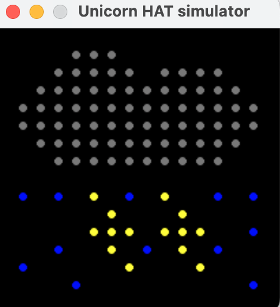
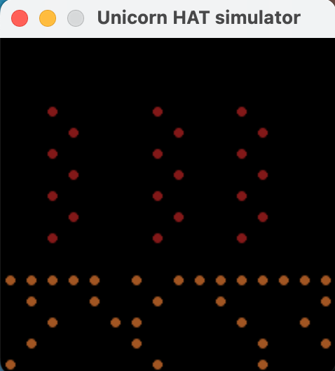
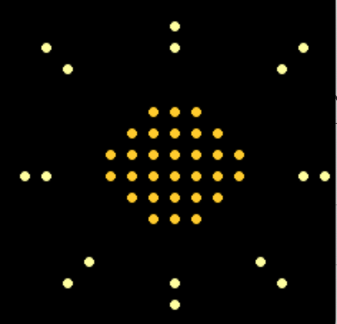
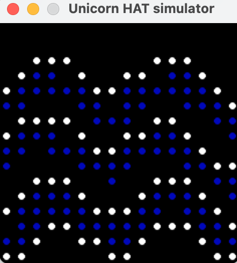
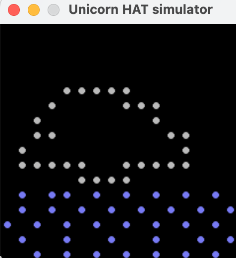
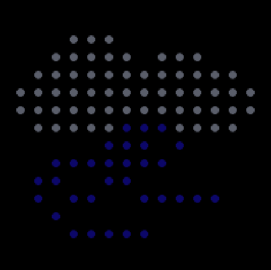

Phénomènes illustrés
==========================

Dans cette partie de la documentation, vous retrouverez une illustration des matrices précédemment décrites dans **phénomènes métérologiques**

Tempête
-------

.. code-block:: python

    if (meteo=="tempete"):
            nbMatrice = tempete_gl.nbMatrice()
            for i in range (5): #l'animation va tourner 5 fois
                for j in range (1, nbMatrice+1):
                    test_matrix.execute(tempete_gl.tempete(j),0.5)
                    if (i == 1):
                        if (j==1): #permet d'afficher la meteo
                            print(meteo) 

Ici, c'est la tempête qui s'affiche, avec 2 boucles for: l'une pour définir la durée, l'autre pour alterner et donner l'effet d'animation.
Voici une des images obtenues finalement: 

Sécheresse
----------

.. code-block:: python

    elif (meteo=="secheresse"):
        nbMatrice = secheresse_gl.nbMatrice()
        for i in range (5): #l'animation va tourner 5 fois
            for j in range (1, nbMatrice+1):
                test_matrix.execute(secheresse_gl.secheresse(j),0.5)
                if (i == 1):
                    if (j==1): #permet d'afficher la meteo
                        print(meteo)

Ici, c'est la sécheresse qui s'affiche, avec 2 boucles for: l'une pour définir la durée, l'autre pour alterner et donner l'effet d'animation.
Voici une des images en sortie: 

Soleil
------

.. code-block:: python

    elif (meteo=="soleil"):
        nbMatrice = soleil.nbMatrice()
        for i in range (5): #l'animation va tourner 5 fois
            for j in range (1, nbMatrice+1):
                test_matrix.execute(soleil.soleil(j),0.5)
                if (i == 1):
                    if (j==1): #permet d'afficher la meteo
                        print(meteo)

Grâce à cette partie de meteo.py, voilà ce que nous avons en sortie: 

Inondation
----------

Voici la partie de la boucle qui permet d'afficher le phénomène d'inondation: 

.. code-block:: python

    elif (meteo=="innondation"):
        nbMatrice = Innondation.nbMatrice()
        for i in range (5): #l'animation va tourner 5 fois
            for j in range (1, nbMatrice+1):
                test_matrix.execute(Innondation.innondation(j),0.5)
                if (i == 1):
                    if (j==1): #permet d'afficher la meteo
                        print(meteo)

Voici ce que ce programme nous donne en sortie:

Pluie
-----
Pour pouvoir afficher la pluie:

.. code-block:: python

    elif (meteo=="pluie"):
        nbMatrice = pluie.nbMatrice()
        for i in range (5): #l'animation va tourner 5 fois
            for j in range (1, nbMatrice+1):
                test_matrix.execute(pluie.pluie(j),0.5)
                if (i == 1):
                    if (j==1): #permet d'afficher la meteo
                        print(meteo)

Voici ce que ce programme nous donne en sortie:

Nuageux
-------

Pour pouvoir afficher un temps nuageux:

.. code-block:: python

    elif (meteo=="nuageux"):
        nbMatrice = nuageux.nbMatrice()
        for i in range (5): #l'animation va tourner 5 fois
            for j in range (1, nbMatrice+1):
                test_matrix.execute(nuageux.nuageux(j),0.5)
                if (i == 1):
                    if (j==1): #permet d'afficher la meteo
                        print(meteo)

Voici ce que ce programme nous donne en sortie:

Couvert
-------

Pour pouvoir afficher un temps couvert:

.. code-block:: python

    elif (meteo=="couvert"):
        nbMatrice = couvert.nbMatrice()
        for i in range (5): #l'animation va tourner 5 fois
            for j in range (1, nbMatrice+1):
                test_matrix.execute(couvert.couvert(j),0.5)
                if (i == 1):
                    if (j==1): #permet d'afficher la meteo
                        print(meteo)

Voici ce que ce programme nous donne en sortie:

Orage
-----

Pour pouvoir afficher un temps Couvert:

.. code-block:: python

    elif (meteo=="orage"):
        nbMatrice = couvert.nbMatrice()
        for i in range (5): #l'animation va tourner 5 fois
            for j in range (1, nbMatrice+1):
                test_matrix.execute(orage.orage(j),0.5)
                if (i == 1):
                    if (j==1): #permet d'afficher la meteo
                        print(meteo)

Voici ce que ce programme nous donne en sortie:

Ouragan
-------

Pour pouvoir afficher l'ouragan :

.. code-block:: python

    elif (meteo=="ouragan"):
        nbMatrice = ouragan.nbMatrice()
        for i in range (5): #l'animation va tourner 5 fois
            for j in range (1, nbMatrice+1):
                test_matrix.execute(Ouragan.ouragan(j),0.5)
                if (i == 1):
                    if (j==1): #permet d'afficher la meteo
                        print(meteo)

Voici ce que ce programme nous donne en sortie:

    

Tornade
-------

Pour pouvoir afficher la tornade :

.. code-block:: python

    elif (meteo=="tornade"):
        nbMatrice = tornade.nbMatrice()
        for i in range (5): #l'animation va tourner 5 fois
            for j in range (1, nbMatrice+1):
                test_matrix.execute(Tornade.tornade(j),0.5)
                if (i == 1):
                    if (j==1): #permet d'afficher la meteo
                        print(meteo)

Voici ce que ce programme nous donne en sortie:

    

